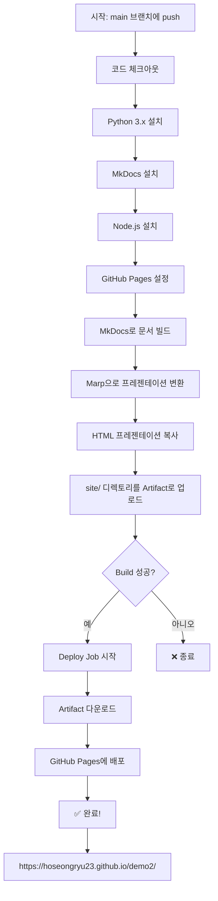

# GitHub Actions 워크플로우 완전 정복 가이드

> **대상**: 프로그래밍을 배우는 대학생  
> **목표**: GitHub Actions를 사용해 자동으로 웹사이트를 배포하는 방법 이해하기

---

## 🤔 이게 뭐하는 파일인가요?

여러분이 GitHub에 코드를 올리면(push), **자동으로 웹사이트를 만들어서 인터넷에 올려주는 로봇**이라고 생각하면 됩니다.

### 비유로 이해하기

**전통적인 방법** (수작업):
1. 코드 수정
2. 내 컴퓨터에서 빌드 (HTML 생성)
3. FTP 프로그램으로 서버에 업로드
4. 웹사이트 확인

**GitHub Actions** (자동화):
1. 코드 수정하고 GitHub에 push
2. ✨ **끝!** ✨ (나머지는 자동으로 처리됨)

---

## 📚 사전 지식

이 문서를 이해하려면 다음 개념을 알고 있으면 좋습니다:

- **Git/GitHub**: 코드 버전 관리 시스템
- **Markdown**: `.md` 파일, 간단한 문서 작성 언어
- **HTML**: 웹 페이지를 만드는 언어
- **YAML**: 설정 파일 형식 (들여쓰기가 중요!)

---

## 🏗️ 파일 구조 한눈에 보기

```yaml
name: Deploy Docs & Presentation        # 워크플로우 이름 (무엇을 하는지 설명)

on:                                      # 언제 실행할지?
  push:                                  # main 브랜치에 코드를 올릴 때
    branches:
      - main
  workflow_dispatch:                     # 또는 수동으로 실행 버튼을 누를 때

permissions:                             # 권한 설정 (무엇을 할 수 있는지)
  contents: read                         # 코드 읽기 권한
  pages: write                           # GitHub Pages에 쓰기 권한
  id-token: write                        # 인증 토큰 생성 권한

jobs:                                    # 실제로 할 일들
  build:                                 # 첫 번째 작업: 웹사이트 만들기
    # ... (상세 내용)
  
  deploy:                                # 두 번째 작업: 웹사이트 배포하기
    # ... (상세 내용)
```

---

## 🎬 1단계: 언제 실행될까요?

```yaml
on:
  push:
    branches:
      - main
  workflow_dispatch:
```

### 트리거(Trigger) 조건

**트리거란?** 자동화 작업을 시작하게 만드는 "방아쇠"

이 워크플로우는 2가지 방법으로 실행됩니다:

#### 방법 1: 자동 실행 (`push`)
```bash
# 내가 이렇게 하면...
git add .
git commit -m "프레젠테이션 수정"
git push origin main

# → GitHub Actions가 자동으로 실행됨!
```

#### 방법 2: 수동 실행 (`workflow_dispatch`)
1. GitHub 리포지토리 접속
2. "Actions" 탭 클릭
3. "Deploy Docs & Presentation" 선택
4. "Run workflow" 버튼 클릭

---

## 🔐 2단계: 권한 설정

```yaml
permissions:
  contents: read
  pages: write
  id-token: write
```

### 왜 권한이 필요할까?

**비유**: 은행 업무를 대신해주는 사람에게 위임장을 주는 것과 같습니다.

- **`contents: read`**: "코드 읽어도 돼" (리포지토리 내용 확인)
- **`pages: write`**: "GitHub Pages에 올려도 돼" (웹사이트 배포)
- **`id-token: write`**: "내 신분증 만들어도 돼" (인증용)

---

## ⚙️ 3단계: 동시 실행 제어

```yaml
concurrency:
  group: "pages"
  cancel-in-progress: false
```

### 무슨 뜻일까?

**상황**: 첫 번째 배포가 진행 중인데 또 push를 했다면?

- **`group: "pages"`**: "pages"라는 그룹으로 묶음 → 같은 그룹은 동시에 1개만 실행
- **`cancel-in-progress: false`**: 진행 중인 작업 취소 안 함 → 둘 다 완료될 때까지 기다림

**비유**: 프린터 대기열과 비슷합니다. 한 번에 하나씩 인쇄하되, 앞 문서를 취소하지 않습니다.

---

## 🔨 4단계: Build Job (웹사이트 만들기)

### 전체 흐름

```
1. 코드 가져오기
2. 도구 설치 (Python, Node.js)
3. 문서 사이트 만들기 (MkDocs)
4. 프레젠테이션 만들기 (Marp)
5. 파일 정리
6. 업로드
```

---

### Step 1: 코드 체크아웃

```yaml
- name: Checkout
  uses: actions/checkout@v4
```

**의미**: GitHub에서 내 코드를 다운로드받기

**비유**: 도서관에서 책을 빌려오는 것

**왜 필요해?** GitHub Actions는 별도의 깨끗한 컴퓨터에서 실행됩니다. 처음엔 코드가 없으니 가져와야 합니다!

---

### Step 2-3: Python 설치 + MkDocs 설치

```yaml
- name: Setup Python
  uses: actions/setup-python@v4
  with:
    python-version: '3.x'

- name: Install MkDocs and Material Theme
  run: pip install mkdocs-material
```

**MkDocs란?** Markdown 파일(`.md`)을 멋진 HTML 웹사이트로 변환해주는 도구

**과정**:
```
DOCS/PRD.md         →  MkDocs  →  site/PRD/index.html
DOCS/Tutorial.md    →           →  site/Tutorial/index.html
DOCS/Tasks.md       →           →  site/Tasks/index.html
```

**비유**: 워드 파일을 PDF로 변환하는 것과 비슷

---

### Step 4: Node.js 설치

```yaml
- name: Setup Node.js
  uses: actions/setup-node@v4
  with:
    node-version: 'lts/*'
```

**Node.js란?** JavaScript를 실행할 수 있는 환경 (브라우저 밖에서도!)

**왜 필요해?** 다음 단계에서 사용할 `Marp CLI`가 Node.js로 만들어졌기 때문

**LTS란?** Long Term Support - 안정적이고 오래 지원되는 버전

---

### Step 5: GitHub Pages 설정

```yaml
- name: Setup Pages
  uses: actions/configure-pages@v5
```

**의미**: GitHub Pages 배포 준비

**자동으로 하는 일**:
- 배포할 URL 확인 (`https://username.github.io/repo-name/`)
- 필요한 환경 변수 설정
- 권한 확인

---

### Step 6: MkDocs 사이트 빌드

```yaml
- name: Build MkDocs Site
  run: mkdocs build
```

**실행되는 과정**:

1. `mkdocs.yml` 파일 읽기 → 설정 확인
2. `DOCS/` 디렉토리의 모든 `.md` 파일 찾기
3. Markdown → HTML 변환
4. Material 테마 적용 (예쁘게 만들기)
5. `site/` 디렉토리에 결과물 저장

**결과물**:
```
site/
├── index.html          (메인 페이지)
├── PRD/
│   └── index.html
├── Tutorial/
│   └── index.html
└── ...
```

---

### Step 7: Marp 프레젠테이션 빌드

```yaml
- name: Build Marp Presentation
  run: |
    mkdir -p site/presentation
    npx -y @marp-team/marp-cli@latest DOCS/Presentation.md -o site/presentation/index.html
```

**줄별 설명**:

#### 첫 번째 줄: `mkdir -p site/presentation`
- **`mkdir`**: 폴더 만들기 (Make Directory)
- **`-p`**: 부모 폴더도 필요하면 같이 만들기
- **결과**: `site/presentation/` 폴더 생성

#### 두 번째 줄: `npx -y @marp-team/marp-cli@latest ...`
- **`npx`**: npm 패키지를 설치하지 않고 바로 실행
- **`-y`**: "모두 yes" (자동으로 승인)
- **`@marp-team/marp-cli@latest`**: Marp CLI 최신 버전 사용
- **`DOCS/Presentation.md`**: 입력 파일 (Markdown 프레젠테이션)
- **`-o site/presentation/index.html`**: 출력 파일 (HTML 프레젠테이션)

**Marp란?** Markdown으로 작성한 내용을 PowerPoint 같은 슬라이드로 변환

**변환 과정**:
```markdown
# 제목 슬라이드

---

# 두 번째 슬라이드
- 항목 1
- 항목 2
```
↓  
Interactive HTML 슬라이드

---

### Step 8: HTML 프레젠테이션 복사

```yaml
- name: Copy HTML Presentation
  run: |
    cp DOCS/presentation.html site/presentation/html.html
```

**`cp` 명령어**: Copy (파일 복사)

**과정**:
```
DOCS/presentation.html  →  (복사)  →  site/presentation/html.html
```

**왜 복사할까?** 
- 원본은 `DOCS/`에 보관
- 배포할 파일은 `site/`에 모아야 함
- 다른 이름(`html.html`)으로 저장해서 Marp 버전과 구분

---

### Step 9: Artifact 업로드

```yaml
- name: Upload artifact
  uses: actions/upload-pages-artifact@v3
  with:
    path: 'site'
```

**Artifact란?** 빌드 결과물을 저장해둔 압축 파일

**과정**:
```
site/ 디렉토리 전체  →  압축  →  GitHub 서버에 임시 저장
```

**왜 필요해?** 
- Build job과 Deploy job이 분리되어 있음
- Build에서 만든 파일을 Deploy에서 사용해야 함
- Artifact로 저장해서 다음 job으로 전달

**비유**: 공장(Build)에서 만든 제품을 창고(Artifact)에 보관했다가 배송팀(Deploy)이 가져가는 것

---

## 🚀 5단계: Deploy Job (웹사이트 배포하기)

```yaml
deploy:
  environment:
    name: github-pages
    url: ${{ steps.deployment.outputs.page_url }}
  runs-on: ubuntu-latest
  needs: build
  steps:
    - name: Deploy to GitHub Pages
      id: deployment
      uses: actions/deploy-pages@v4
```

### 핵심 개념

#### `needs: build`
**의미**: build job이 **성공적으로** 완료된 후에만 실행

**순서 보장**:
```
Build Job  →  (성공?)  →  Deploy Job
              (실패?)  →  ❌ Deploy 안 함
```

#### `environment: github-pages`
**의미**: GitHub Pages 환경으로 배포

**자동으로 하는 일**:
- 배포 히스토리 기록
- URL 자동 생성
- HTTPS 적용

#### `${{ steps.deployment.outputs.page_url }}`
**의미**: 배포된 웹사이트 URL을 변수로 가져오기

**결과**: `https://hoseongryu23.github.io/demo2/`

---

## 🎯 전체 프로세스 플로우차트



---

## 📂 최종 결과물 구조

배포 후 웹사이트 구조:

```
https://hoseongryu23.github.io/demo2/
│
├── index.html                     ← DOCS/index.md (메인 페이지, 리다이렉트)
│
├── PRD/
│   └── index.html                 ← DOCS/PRD.md
│
├── Tutorial/
│   └── index.html                 ← DOCS/Tutorial.md
│
├── Tasks/
│   └── index.html                 ← DOCS/Tasks.md
│
└── presentation/
    ├── index.html                 ← DOCS/Presentation.md (Marp 변환)
    └── html.html                  ← DOCS/presentation.html (커스텀)
```

---

## 🔍 실전 예제: 워크플로우 실행 추적하기

### 1. GitHub에서 확인하기

```
1. 리포지토리 → Actions 탭
2. "Deploy Docs & Presentation" 클릭
3. 실행 중인 워크플로우 확인
```

### 2. 로그 읽는 법

```
✅ Checkout                     (2초)
✅ Setup Python                 (3초)
✅ Install MkDocs               (5초)
✅ Setup Node.js                (4초)
✅ Setup Pages                  (1초)
✅ Build MkDocs Site            (3초)
✅ Build Marp Presentation      (8초)
✅ Copy HTML Presentation       (1초)
✅ Upload artifact              (2초)
✅ Deploy to GitHub Pages       (15초)
```

각 단계 옆의 시간은 대략적인 소요 시간입니다.

---

## 💡 자주 묻는 질문 (FAQ)

### Q1: 워크플로우가 실패했어요!

**해결 방법**:
1. Actions 탭에서 실패한 step 확인
2. 빨간색 ❌ 표시된 로그 열기
3. 에러 메시지 읽기
4. 주요 에러 패턴:
   - `File not found` → 파일 경로 확인
   - `Permission denied` → 권한 설정 확인
   - `Command not found` → 설치 단계 확인

### Q2: 배포는 성공했는데 웹사이트가 안 보여요!

**체크리스트**:
- [ ] Settings → Pages에서 GitHub Pages 활성화 확인
- [ ] Source가 "GitHub Actions"로 설정되어 있는지 확인
- [ ] 5-10분 정도 기다려보기 (DNS 전파 시간)
- [ ] URL이 정확한지 확인

### Q3: 로컬에서 테스트할 수 있나요?

**네! 각 단계를 직접 실행해볼 수 있습니다**:

```bash
# MkDocs 빌드
mkdocs build

# Marp 변환
npx @marp-team/marp-cli DOCS/Presentation.md -o output.html

# 결과 확인
cd site
python -m http.server 8000
# 브라우저에서 http://localhost:8000 접속
```

### Q4: 왜 이렇게 복잡한가요?

**단순한 방법**도 있지만, 이 워크플로우의 장점:
- ✅ **자동화**: 한 번 설정하면 계속 사용
- ✅ **일관성**: 항상 같은 방법으로 빌드
- ✅ **이력 관리**: 모든 배포 기록 남음
- ✅ **무료**: GitHub Actions 무료 사용량 충분

---

## 🎓 더 공부하고 싶다면

### 추천 학습 순서

1. **Git & GitHub 기초**
   - [GitHub Learning Lab](https://lab.github.com/)
   - Git 명령어: `add`, `commit`, `push`

2. **Markdown 문법**
   - [Markdown Guide](https://www.markdownguide.org/)
   - 헤딩, 리스트, 링크, 이미지

3. **YAML 기초**
   - 들여쓰기 규칙
   - 키-값 쌍
   - 리스트와 딕셔너리

4. **GitHub Actions 심화**
   - [공식 문서](https://docs.github.com/en/actions)
   - 다른 워크플로우 예제 분석
   - 커스텀 Actions 만들기

---

## 📝 마무리 연습 문제

### 연습 1: 워크플로우 수정하기
**과제**: Node.js 버전을 최신 LTS에서 버전 18로 고정하기

<details>
<summary>정답 보기</summary>

```yaml
- name: Setup Node.js
  uses: actions/setup-node@v4
  with:
    node-version: '18'  # 'lts/*'에서 변경
```
</details>

### 연습 2: 새로운 스텝 추가하기
**과제**: 빌드 후 파일 개수를 출력하는 스텝 추가

<details>
<summary>정답 보기</summary>

```yaml
- name: Count files
  run: |
    echo "Total files in site directory:"
    find site -type f | wc -l
```
</details>

### 연습 3: 조건부 실행
**과제**: 특정 파일이 변경되었을 때만 MkDocs 빌드하기

<details>
<summary>정답 보기</summary>

```yaml
- name: Build MkDocs Site
  if: contains(github.event.head_commit.message, '[docs]')
  run: mkdocs build
```
</details>

---

## 🎉 축하합니다!

이제 여러분은:
- ✅ GitHub Actions 워크플로우 구조를 이해했습니다
- ✅ 각 단계가 무엇을 하는지 알게 되었습니다
- ✅ 자동 배포 시스템의 원리를 파악했습니다

**다음 단계**: 직접 워크플로우를 수정해보고, 나만의 자동화 시스템을 만들어보세요! 🚀

---

**작성자**: Antigravity  
**작성일**: 2025-12-23  
**문서 버전**: 1.0
